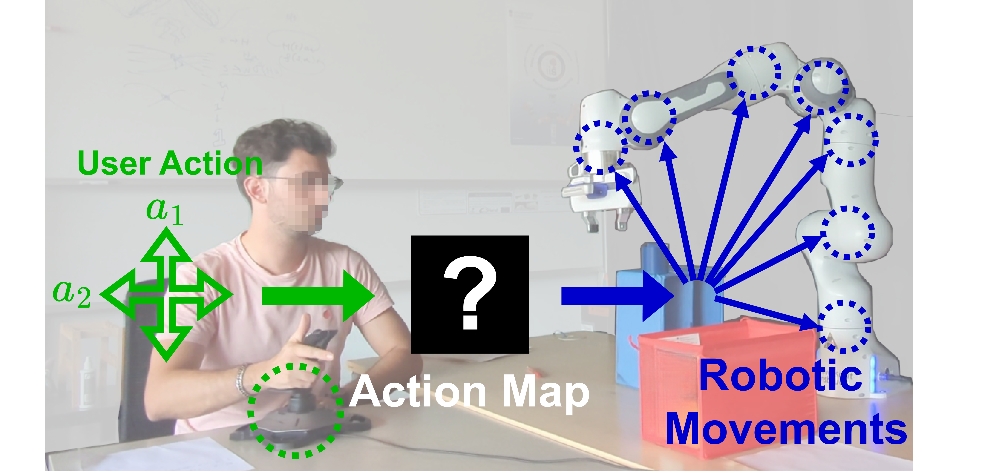
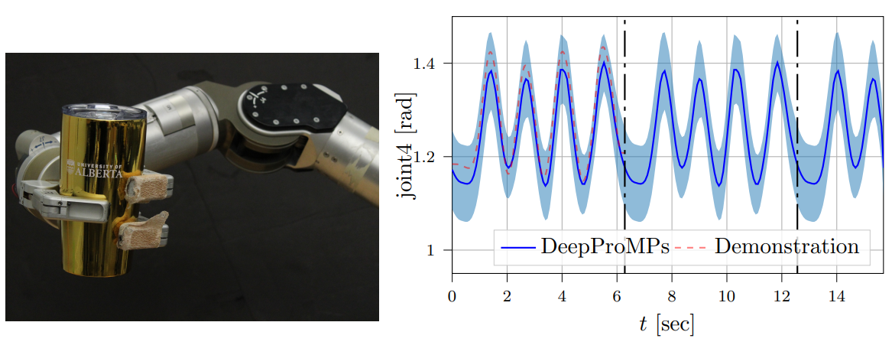
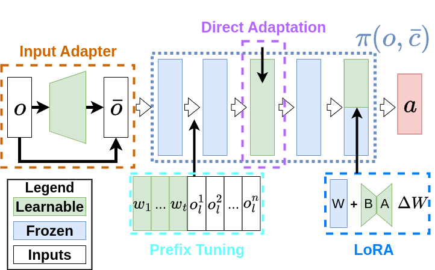

---

##### Download

 + Dissertation (Coming Soon!)<!--[Dissertation](dissertation.pdf) -->
<!-- + [Code and data](https://github.com/pmichaillat/feru) --> 
<!-- comment format-->

---

##### Abstract

This dissertation investigates methods for incorporating robotic domain knowledge into deep learning systems to represent different action spaces. Robots can be controlled through action spaces spanning different levels of abstraction, from low-level joint torques to high-level Cartesian poses. Beyond physical action spaces, latent action spaces offer learned embeddings that coordinate atomic commands into coherent patterns—motivated by the manifold hypothesis that robot actions often lie on lower-dimensional manifolds. A key limitation of existing latent action space learning is that current models often ignore available prior knowledge, requiring substantially more data than approaches that explicitly encode motion structure. Our hypothesis is that encoding robotic priors into deep learning architectures improves performance for both autonomous agents and human operators interacting with the system.
    
We present three primary contributions toward this goal. First, we develop local-linear neural networks that explicitly encode human priors in teleoperation systems. This architecture has nonlinear transformations of robot-state variables but behaves linearly with respect to user inputs, enforcing scalability, consistency, reversibility, and controllability. Our user studies demonstrate significant improvements over alternative deep learning systems and provide a more interpretable framework for explaining human success rates. Second, we incorporate Bayesian aggregation with neural networks to develop more robust deep learning movement primitives that perform well with less data on real robot systems while offering greater flexibility in specifying motor-primitive skills. Third, we improve the transferability of cross-embodiment control policies that leverage a robot's topological structure, showing that transfer often requires specialization to the target embodiment and can be adjusted to fit available compute resources.

Our work develops neural architectures with robot domain knowledge spanning spatial relations, temporal interactions, and robot topological structure. These contributions highlight the significant role domain knowledge continues to play in developing robot learning systems that generalize well to changing situations. This work represents a step toward better modular deep learning components that are interpretable, data-efficient, and reusable across different robotic platforms and tasks. 

---

##### Figure 3.1 : User teleoperating a 7-DOF robot using a 2D joystick with a data-driven spatial mapping interface.




#### Figure 5.5: **Left**: Experimental setup of Make Mojito. **Right**: Demonstrated motion and learned cyclical behaviour. Results demonstrate that DeepProMPS can smoothly repeat cyclical motions indefinitely.


#### Figure 6.3: A visualization of the various PEFT techniques considered in this paper. We investigate applying PEFT techniques independently from each other.

---

<!-- 
##### Citation

Unterholzer, Detlev A., and  Moritz-Maria von Igelfeld. 2013. "Unusual Uses For Olive Oil." *Journal of Oleic Science* 34 (1): 449–489. http://www.alexandermccallsmith.com/book/unusual-uses-for-olive-oil.

```latex
@article{UI13,
author = {Detlev A. Unterholzer and Moritz-Maria von Igelfeld},
year = {2013},
title ={Unusual Uses For Olive Oil},
journal = {Journal of Oleic Science},
volume = {34},
number = {1},
pages = {449--489},
url = {http://www.alexandermccallsmith.com/book/unusual-uses-for-olive-oil}}
```

---
##### Related material

+ [Presentation slides](presentation1.pdf)
+ [Summary of the paper](https://www.penguinrandomhouse.com/books/110403/unusual-uses-for-olive-oil-by-alexander-mccall-smith/)
-->